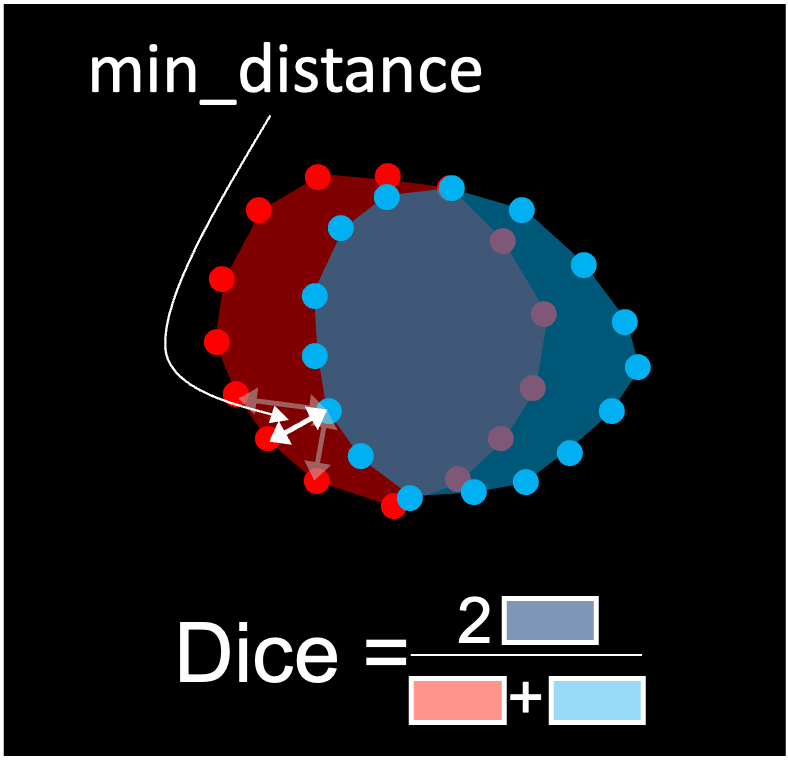

# `contour` - Evaluate metrics between two sets of contours

This pipeline compares comparable contours (i.e. of the same participant, carotid, object and axial slice)
using two metrics:

- the [Dice score](https://en.wikipedia.org/wiki/S%C3%B8rensen%E2%80%93Dice_coefficient) compares the areas
enclosed in the contours. For the wall, the area enclosed by the lumen is not considered.
- the minimal euclidean distance between each point of the first contour (transform) and the second contour (reference).
*Note that this metric is not symmetric and depends on which contour is the first or second*.


<p style="text-align: center;"><b>Example of lumen contours being compared. In this example the first contour is the blue
one and the reference is in red.</b></p>

## Prerequisites

This step relies on the outputs of `transform contour`.

## Running the task

The task can be run with the following command line:
```
carotid compare centerline TRANSFORM_DIR REFERENCE_DIR OUTPUT_DIR
```
where:

- `TRANSFORM1_DIR` (str) is the path to the directory containing the first set of contours.
- `TRANSFORM2_DIR` (str) is the path to the directory containing the set of contours which are considered as 
a reference (for example manual annotations).
- `OUTPUT_DIR` (str) is the path to the directory in which the TSV files `compare_contour_dice.tsv`
and `compare_contour_points.tsv` will be written.

## Outputs

This pipeline writes two TSV files. `compare_contour_dice.tsv` has the following structure:

| participant_id | side  | label    | object | z   | dice_score |
|----------------|-------|----------|--------|-----|------------|
| Anon450        | left  | internal | lumen  | 340 | 0.95       | 
| Anon450        | left  | internal | lumen  | 341 | 0.87       |
| ...            | ...   | ...      | ...    | ... | ...        |
| Anon062        | right | external | wall   | 413 | 0.0        |

for each contour, only one value is computed.

----
`compare_contour_points.tsv` has the following structure:

| participant_id | side  | label    | object | z   | x     | y    | deviation | min_distance |
|----------------|-------|----------|--------|-----|-------|------|-----------|--------------|
| Anon450        | left  | internal | lumen  | 340 | 250.5 | 52.3 | 0.60      | 1.1          |
| Anon450        | left  | internal | lumen  | 341 | 249.7 | 52.1 | 0.70      | 1.3          |
| ...            | ...   | ...      | ...    | ... | ...   | ...  | ...       | ...          |
| Anon062        | right | external | wall   | 413 | 626.9 | 12.5 | 1.65      | 0.5          |

In this file two values exist per point in contours: the `deviation` is the uncertainty already
computed by the `transform` command. The min_distance is the metrics computed by `compare`.