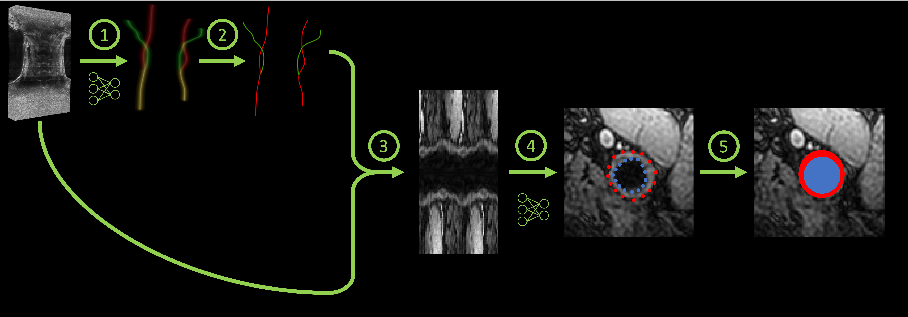

# `pipeline_transform` - Extract carotid characteristics from raw images

This transform execute the following series of transforms:

1. [Inference of heatmaps](./Heatmap.md)
2. [Extraction of centerlines](./Centerline.md)
3. [Computation of polar images](./Polar.md)
4. [Inference of contours](./Contour.md)
5. [Computation of binary voxel masks](./Segmentation.md)


<p style="text-align: center;"><b>Illustration of the application of the pipeline. For more information
on each intermediate step, please refer to the corresponding documentation. </b></p>

## Prerequisites

Make sure that your data set is correctly structured (see the [data section](../Data.md) for more information).

You need to prepare two directories:

1. storing U-Nets trained to extract centerlines,
2. storing CNNs trained to estimate the lumen and walls rays.

## Running the task

The task can be run with the following command line:
```
carotid pipeline_transform RAW_DIR HEATMAP_MODEL_DIR CONTOUR_MODEL_DIR OUTPUT_DIR
```
where:

- `RAW_DIR` (str) is the path to the directory containing the raw data.
- `HEATMAP_MODEL_DIR` (str) is the path to the directory containing the weights of the pre-trained U-Net(s).
- `CONTOUR_MODEL_DIR` (str) is the path to a directory where the model(s) for contour extraction are stored.
- `OUTPUT_DIR` (str) is the path to the directory containing the outputs.

Options:

- `--config_path` (str) is the path to a config file defining the values of the parameters.
For more information on the config file, refer to [this section](../Configuration.md).
- `--participant` (List[str]) restricts the application of the transform to this list of participant IDs. 
Default will perform the pipeline on all participants with a raw image.
- `--device` (`cuda`|`cpu`) is the device that will be used to perform the forward pass of the U-Net.
Default will try to find `cuda`, and use `cpu` if it is not available.
- `--force` is a flag that forces the application of the transform in the chosen output directory,
even if the transform was already performed in this folder.

!!! warning "Force the transform"
    If the `force` flag is given this will erase the directory located at `OUTPUT_DIR`.

## Default parameters

The parameters of the full pipeline corresponds to the series of parameters
which can be chosen for each transform. They are listed below:

1. [Inference of heatmaps](./Heatmap.md)
   - `roi_size` (Tuple[int, int, int]) is the size of the window used to infer the whole heatmap. The order of the coordinates is (X, Y, Z). 
   Default: `(64, 64, 160)`. 
   - `spacing` (bool) indicates if the image should be resamples to the resolution used by the network [0.5, 0.5, 0.5]. If the resolution of your image
   is close to this resolution, you can choose to disable resampling to gain computational time and avoid image distortion. Default: `True`.
2. [Extraction of centerlines](./Centerline.md)
   - `step_size` (int) is the size of the stack of axial slices from which seeds are extracted. Default: `50`.
   - `threshold` (float) is used to determine from which axial slices seeds will be extracted: if the maximum value of
   a slice is higher than this threshold it is kept. Default: `100`.
   - `spatial_threshold` (int) is the voxel distance beyond which two centers are considered as identical. Default: `5`.
3. [Computation of polar images](./Polar.md)
   - `n_angles` (int) Number of rays that are interpolated. Default: `31`.
   - `polar_ray` (int) Size of the ray in the polar space. Default: `127`. 
   - `cartesian_ray` (int) Size of the ray in the cartesian space. Default: `100`.
   - `length` (int) Number of axial slices used for one polar image. Default: `7`.
   - `multiple_centers` (bool) if `True`, a batch of 3D polar images of size (`9`, `1`, <code>length</code>, `2*n_angles`, <code>polar_ray</code>) will be extracted.
   This 9 images correspond to the polar transform according to the 8 voxels around the original center in the given axial plane + the
   original center. Default is `False`.
4. [Inference of contours](./Contour.md)
   - `dropout` (bool) if `True`, the dropout layers will be activated Default: `False`.
   - `n_repeats` (int) is the number of times each polar image is processed by each network.
   This repetition is performed only if `dropout` is set to `True`. Default: `20`
   - `delta_theta` (float) Default: `0.0625`

There are no possible parameters for the [computation of binary voxel masks](./Segmentation.md).

## Outputs

