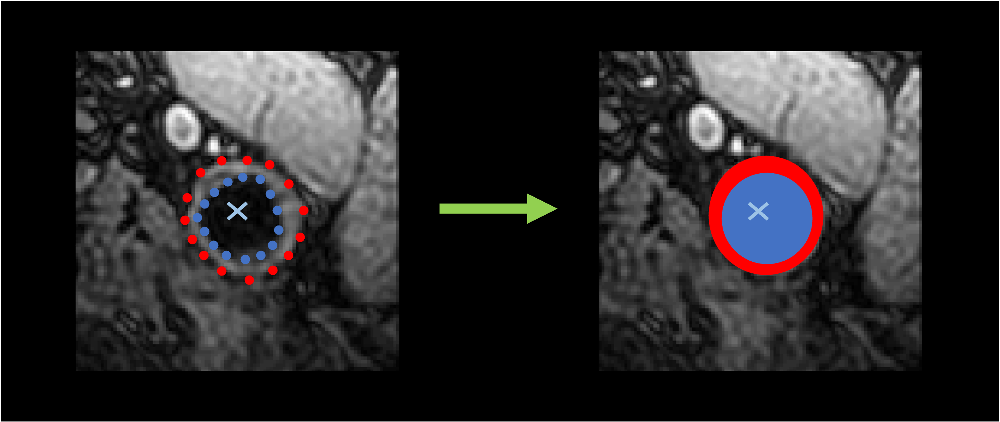

# `segmentation_transform` - Compute binary voxel masks from contours

This transform relies on the Python packages `shapely` and `rasterio`.
The external and internal carotids are combined after this transform. 



## Prerequisites

This step relies on the outputs of `contour_transform`.

!!! warning "JSON parameters"
    This step does not only require the contour TSV files but will try to
    load and update the `parameters.json` file in the directory in which contours are
    stored. Make sure this file exists at the root of the contours directory.

## Running the task

The task can be run with the following command line:
```
carotid segmentation_transform OUTPUT_DIR
```
where:

- `OUTPUT_DIR` (str) is the path to the directory containing the outputs.

Options:

- `--contour_dir` (str) is the path to a different directory in which the contours are stored.
Default will assume that `contour_transform` was run in the output directory.
- `--config_path` (str) is the path to a config file defining the values of the parameters.
- `--participant` (List[str]) restricts the application of the transform to this list of participant IDs. 
Default will perform the pipeline on all participants with a raw image.
- `--force` is a flag that forces the application of the transform in the chosen output directory,
even if the transform was already performed in this folder.

## Default parameters

There are no parameters for this transform.

## Outputs

Output structure for participant `participant_id`:
```console
<output_dir>
├── parameters.json
└── <participant_id>
        └── contour_transform
                ├── left_segmentation.mha
                └── right_segmentation.mha
```

where:

- `parameters.json` is a JSON file summarizing the parameters used to perform this transform and eventually preceding ones.
- `<side>_segmentation.mha` is a volume with the same spatial size than the corresponding raw input and two channels.
The first channel corresponds to the mask of the lumens, the second one is the mask of the walls.