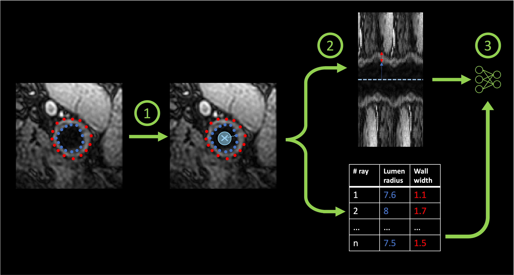

# `contour` - Train a CNN to reproduce contours 

This command allows to train a series of CNNs to find the lumen and wall radii in polar maps.
Polar maps and the corresponding annotations are extracted on-the-fly by contours using the following procedure:

1. A new center is sampled in the disk centered on the center of the lumen with a radius of half of
the minimal radius of the lumen.
2. A polar image and its corresponding annotations (lumen radii and wall width for each angle value) are generated
using the parameters given to characterize the transform.
3. A network is initialized per split in the k-fold cross-validation. This network takes as input the polar
images and learns to reproduce the corresponding annotation.


<p style="text-align: center;"><b>Illustration of the training procedure of the networks.</b></p>

The data set provided is split between training and validation sets using a k-fold cross-validation at the
level of the participant. For each fold a new network is trained from scratch.

The model at the end of the training corresponds to the model which obtained the 
lowest validation loss at the end of an epoch during training.

## Prerequisites

This command requires raw images and corresponding contour annotations. These annotations should be structured in
the same way as the output of `transform contour`. The JSON file at the root of the transform folder is not required though.

Make sure that your data set is correctly structured (see the [data section](../Environment/Data.md) for more information).

!!! note "polar transform"
    This step doesn't need pre-extracted polar images as the polar transform is performed on-the-fly.

## Running the task

The task can be run with the following command line:
```
carotid train contour OUTPUT_DIR RAW_DIR ANNOTATION_DIR
```
where:

- `OUTPUT_DIR` (str) is the path to the directory containing the trained models and corresponding logs.
- `RAW_DIR` (str) is the path to the directory containing the raw data.
- `ANNOTATION_DIR` (str) is the path to the directory containing the contour annotations.

Options:

- `--contour_tsv` (str) is the path to a TSV file listing all the contours that should be used during training
if the whole data set should not be used. It must contain the columns `participant_id`, `side`, `label` and `z`.
- `--train_config_path` (str) is the path to a config file defining the values of the training parameters.
- `--config_path` (str) is the path to a config file defining the values of the parameters of the polar transform.
- `--device` (`cuda`|`cpu`) is the device that will be used to perform the forward pass of the U-Net.
Default will try to find `cuda`, and use `cpu` if it is not available.
- `--force` is a flag that forces the application of the transform in the chosen output directory,
even if the transform was already performed in this folder.

## Default parameters

Two sets of parameters can be provided:
- the parameters corresponding to the polar transform performed on-the-fly.
- the parameters corresponding to the training procedure.

The default parameters corresponding to the polar transform are identical to the ones
of the command `carotid transform polar`. Please refer to the 
[corresponding section](../Transforms/Polar.md#default-parameters) for more information.

The parameters corresponding to the training procedure are the following:

- `dropout` (bool) if `True`, the architecture will contain dropout layers to be used during the inference
for uncertainty quantification. Default: `True`.
- `n_splits` (int) is the number of folds of the K-fold cross-validation procedure performed. This also corresponds
to the numbers of models trained.  Default: `5`.
- `random_seed` (int) is the value of the random seed used to split the dataset for the cross-validation procedure.
Default: `42`.
- `batch_size` (int) is the size of the batch used by the data loaders. Default: `32`.
- `learning_rate` (float) is the learning rate used by the optimizer. Default: `0.001`.
- `n_epochs` (int) is the number of epochs. Default: `200`.

## Outputs

Output structure for participant `participant_id`:
```console
<output_dir>
├── parameters.json
├── split-0
│       ├── group-train_metrics.tsv
│       ├── group-train_prediction.tsv
│       ├── group-validation_metrics.tsv
│       ├── group-validation_prediction.tsv
│       ├── model.pt
│       └── training.tsv
...
└── split-<n_splits>
```


where:

- `parameters.json` is a JSON file summarizing the parameters used to perform the polar transform and the training parameters.
- `group-<subset>_metrics.tsv` is a TSV file including the `MSE` (mean squared error), `L1` (mean absolute error) and `SmoothL1` 
([smooth L1 loss](https://pytorch.org/docs/stable/generated/torch.nn.SmoothL1Loss.html)) across the whole `subset`.
- `group-<subset>_prediction.tsv` is a TSV file including the `MSE`, `L1` and `SmoothL1` for each contour of the `subset`.
- `model.pt` is a file containing a dictionary corresponding to the values obtained for the best model:
  - `model`: model weights,
  - `class`: the class of the model,
  - `epoch`: the epoch at which the model was selected,
  - `validation_loss`: the value of the validation loss,
  - `training_loss`: the value of the training loss (with augmentation).
- `training.tsv` is a TSV file including the value of the training and the validation loss for each epoch.