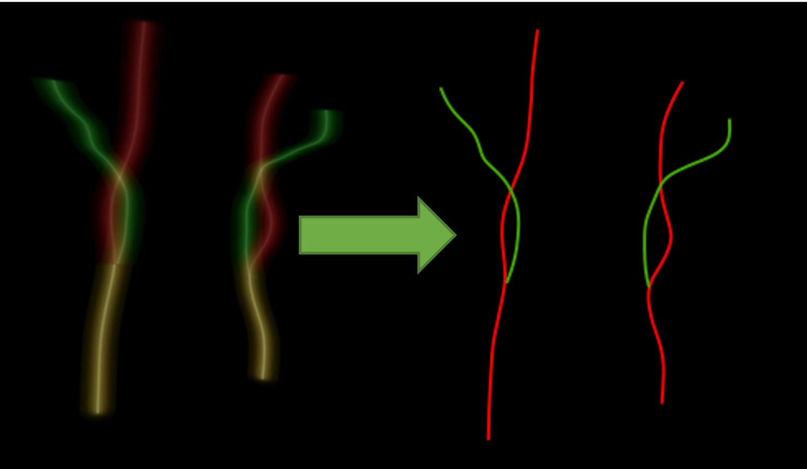

# `centerline` - Compute centerlines from heatmaps

The second step of the pipeline consists in extracting the position of one center per
axial slice from the previously obtained heatmaps.

The current procedure includes three steps:

1. The volume is divided in stack of axial slices, and a seed is found per stack (the point with maximum intensity).
2. Seeds are connected using the Dijkstra algorithm with the cost function between the inverse of the heatmap.
3. The common carotid is labeled as being the internal carotid only: centers of the external carotid which are identical
to the internal ones are removed until a difference is found.



<p style="text-align: center;"><b>Example of heatmaps produced by the network. 
On each side the internal (red) and external (green) carotids are extracted. 
The common carotid (yellow) corresponds to the intersection of the internal 
and external carotids in the lower part of the volume</b></p>

## Prerequisites

This step relies on the outputs of `transform heatmap`.

!!! warning "JSON parameters"
    This step does not only require the heatmap volumes but will try to
    load and update the `parameters.json` file in the directory in which heatmaps are
    stored. Make sure this file exists at the root of the heatmap directory.

## Running the task

The task can be run with the following command line:
```
carotid transform centerline OUTPUT_DIR
```
where:

- `OUTPUT_DIR` (str) is the path to the directory containing the outputs.

Options:

- `--heatmap_dir` (str) is the path to a different directory in which the heatmaps are stored.
Default will assume that `transform heatmap` was run in the output directory.
- `--config_path` (str) is the path to a config file defining the values of the parameters.
- `--participant` (List[str]) restricts the application of the transform to this list of participant IDs. 
Default will perform the pipeline on all participants with a raw image.
- `--force` is a flag that forces the application of the transform in the chosen output directory,
even if the transform was already performed in this folder.

## Default parameters

The following values can be chosen by the user:

- `step_size` (int) is the size of the stack of axial slices from which seeds are extracted. Default: `50`.
- `threshold` (float) is used to determine from which axial slices seeds will be extracted: if the maximum value of
a slice is higher than this threshold it is kept. Default: `100`.
- `spatial_threshold` (int) is the voxel distance beyond which two centers are considered as identical. Default: `5`.

## Outputs

Output structure for participant `participant_id`:
```console
<output_dir>
├── parameters.json
└── <participant_id>
        └── centerline_transform
                ├── left_centerline.tsv
                └── right_centerline.tsv
```

where:

- `parameters.json` is a JSON file summarizing the parameters used to perform this transform and eventually preceding ones.
- `<side>_centerline.tsv` is a TSV file including all the centers described by 7 columns: the first one gives the label (internal or external)
and the next three columns are the x, y, z coordinates of one center, the last three gives measurements to evaluate the uncertainty of the points:

| label    | x   | y   | z   | mean_value | std_value | max_distances |
|----------|-----|-----|-----|------------|-----------|---------------|
| internal | 130 | 80  | 340 | 134.1      | 245.2     | 10.3          |
| internal | 131 | 80  | 341 | 154.3      | 156.2     | 8.4           |
| ...      | ... | ... | ... | ...        | ...       | ...           |
| external | 420 | 57  | 413 | 120.3      | 345.5     | 13.4          |