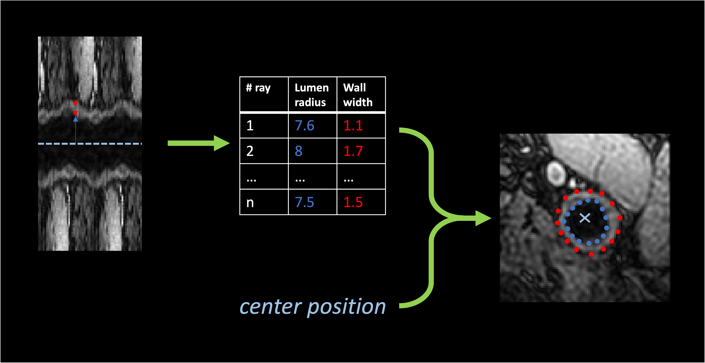
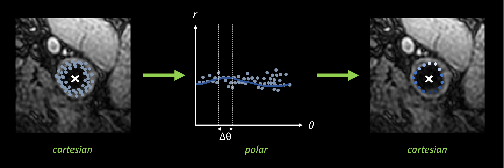

# `contour` - Extract contours of the lumen and wall for each axial slice

This step outputs 2 contours per polar image computed during the previous step: the contour of
the lumen and the contour of the wall of the vessel.
The estimation of the distance between the boundary of the lumen/wall and the center is estimated
for each ray in the polar image by a convolutional neural network.


<p style="text-align: center;"><b>Example of contours. For each ray the radius of the lumen and the
width of the wall is estimated. This allows to build contours of <code>n_angles</code> points
for each object (lumen and wall). </b></p>

This step also gives a measure of the uncertainty by sampling multiple contours for each object.
These contours are sampled up to 3 types of different sources:

- center uncertainty: if `multiple_centers` option was chosen in `polar_transform`, one contour is extracted per center.
- model uncertainty: one contour is extracted per model in stored in `CONTOUR_MODEL_DIR`.
- dropout evaluation: if the model includes dropout layers, these layers can be activated during inference to sample
different results with the same model, by computing a series of outputs for the same image.

For each axial slice a point cloud is extracted. From this (noisy) point cloud a contour is extracted
in the polar domain by fitting a polynomial function to predict the ray from the sine and cosine of the angle
of each point. Then `n_angles` points are extracted using this new model. The uncertainty of a point
is estimated by computing the deviation between all the observed rays in an interval `delta_theta` centered around this point
and the rays that are estimated by the model for the corresponding angle.


<p style="text-align: center;"><b>Evaluation of the uncertainty in the polar domain. Each point in the point cloud is transformed
in polar coordinates using a new center (mean of all points in the point cloud). The deviation between observed and estimated rays
in the interval <code>&Delta;&theta;</code> are used to measure the uncertainty of the final contour.</b></p> 

## Prerequisites

This step relies on the outputs of `transform polar`.

!!! warning "JSON parameters"
    This step does not only require the polar images but will try to
    load and update the `parameters.json` file in the directory in which polar images are
    stored. Make sure this file exists at the root of the directory containing polar images.

You also need to provide one (or several models) for contour regression stored in the same directory.

## Running the task

The task can be run with the following command line:
```
carotid transform contour OUTPUT_DIR CONTOUR_MODEL_DIR
```
where:

- `OUTPUT_DIR` (str) is the path to the directory containing the outputs.
- `CONTOUR_MODEL_DIR` (str) is the path to a directory where the model(s) for contour extraction are stored.

Options:

- `--polar_dir` (str) is the path to a different directory in which the polar images are stored.
Default will assume that `transform polar` was run in the output directory.
- `--config_path` (str) is the path to a config file defining the values of the parameters.
- `--participant` (List[str]) restricts the application of the transform to this list of participant IDs. 
Default will perform the pipeline on all participants with a raw image.
- `--device` (`cuda`|`cpu`) is the device that will be used to perform the forward pass of the U-Net.
Default will try to find `cuda`, and use `cpu` if it is not available.
- `--force` is a flag that forces the application of the transform in the chosen output directory,
even if the transform was already performed in this folder.

## Default parameters

The parameters available are linked to the computation of the uncertainty:

- `dropout` (bool) if `True`, the dropout layers will be activated Default: `False`.
- `n_repeats` (int) is the number of times each polar image is processed by each network.
This repetition is performed only if `dropout` is set to `True`. Default: `20`.
- `delta_theta` (float) Default: `0.0625`.
- `single_center` (bool) if True, only the first element of the batch of polar images will be considered (which
corresponds to using the original center only). Default: `False`.
- `interpolation_method` (`polynomial`|`mean`) is the interpolation method chosen to find the final contour from the
set of contours as well as the uncertainty of each point. If there is more than one center, `polynomial` it will be 
polynomial and corresponds to the method described in the introduction. If `mean` is chosen, each angle will be
associated with the mean (final contour) and standard deviation (uncertainty) of its distances,.


## Outputs

Output structure for participant `participant_id`:
```console
<output_dir>
├── parameters.json
└── <participant_id>
        └── contour_transform
                ├── left_contour.tsv
                ├── right_contour.tsv
                └── spatial_metadata.json
```


where:

- `parameters.json` is a JSON file summarizing the parameters used to perform this transform and eventually preceding ones.
- `spatial_metadata.json` is a JSON file storing the spatial metadata of the corresponding raw image (size and affine).
- `<side>_contour.tsv` is a TSV file including all the points of all contours with the following structure:

| label    | object | x    | y   | z   | deviation |
|----------|--------|------|-----|-----|-----------|
| internal | lumen  | 130  | 80  | 340 | 2.490     |
| internal | lumen  | 131  | 80  | 341 | 3.051     |
| ...      | ...    | ...  | ... | ... | ...       |
| external | wall   | 420  | 57  | 413 | 1.613     |