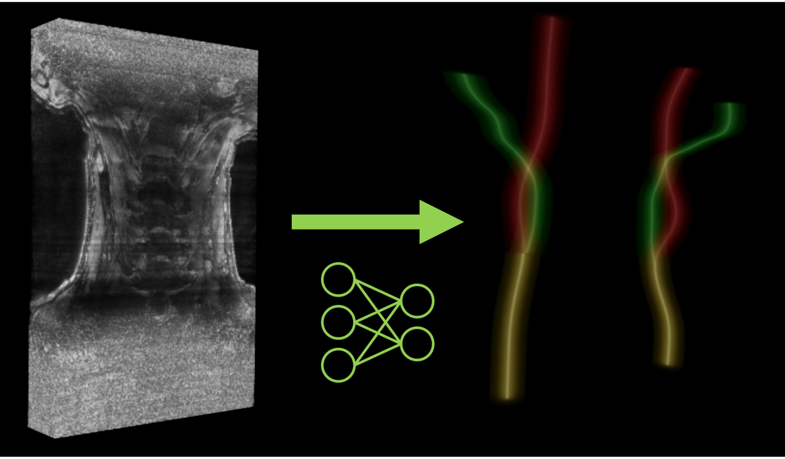

# `heatmap_transform` - Compute heatmaps with pre-trained U-Nets

The first step of the pipeline consists in estimating the position of the centerlines of each carotid.
Each side of the image (left or right) is treated independently. One heatmap is extracted for each side,
and have two channels corresponding to each of the carotid (internal or external).


<p style="text-align: center;"><b>Example of heatmaps produced by the network. On each side the internal 
(red) and external (green) carotids are extracted. The common carotid (yellow) corresponds to the intersection
of the internal and external carotids in the lower part of the volume.</b></p>

## Prerequisites

Make sure that your data set is correctly structured (see the [data section](../Environment/Data.md) for more information).

You also need to provide one (or several models) stored in the same directory.

## Running the task

The task can be run with the following command line:
```
carotid heatmap_transform RAW_DIR HEATMAP_MODEL_DIR OUTPUT_DIR
```
where:

- `RAW_DIR` (str) is the path to the directory containing the raw data.
- `HEATMAP_MODEL_DIR` (str) is the path to the directory containing the weights of the pre-trained U-Net(s).
- `OUTPUT_DIR` (str) is the path to the directory containing the outputs.

Options:

- `--config_path` (str) is the path to a config file defining the values of the parameters.
For more information on the config file, refer to [this section](../Environment/Configuration.md).
- `--participant` (List[str]) restricts the application of the transform to this list of participant IDs. 
Default will perform the pipeline on all participants with a raw image.
- `--device` (`cuda`|`cpu`) is the device that will be used to perform the forward pass of the U-Net.
Default will try to find `cuda`, and use `cpu` if it is not available.
- `--force` is a flag that forces the application of the transform in the chosen output directory,
even if the transform was already performed in this folder.

## Parameters

Two values can be changed in the config file:

- `roi_size` (Tuple[int, int, int]) is the size of the window used to infer the whole heatmap. The order of the coordinates is (Z, Y, X). 
Default: `(368, 64, 320)`. 
- `spacing` (bool) indicates if the image should be resamples to the resolution used by the network [0.5, 0.5, 0.5]. If the resolution of your image
is close to this resolution, you can choose to disable resampling to gain computational time and avoid image distortion. Default: `True`.


## Outputs

Output structure for participant `participant_id`:
```console
<output_dir>
├── parameters.json
└── <participant_id>
        └── heatmap_transform
            ├── left_heatmap
            │   ├── max_indices.npy
            │   ├── mean.mha
            │   └── std.mha
            └── right_heatmap
                ├── max_indices.npy
                ├── mean.mha
                └── std.mha
```

where:

- `parameters.json` is a JSON file summarizing the parameters used to perform this transform and eventually preceding ones.
- `<side>_heatmap` is a folder containing data about the series of heatmaps extracted. Volumes have the same spatial size 
than the corresponding raw input and two channels: the first channel corresponds to the heatmap for the internal carotid, 
the second one corresponds to the external carotid.
  - `mean.mha` is the mean volume of the series.
  - `std.mha` is the standard deviation of the series.
  - `max_indices.npy` contains the list of maximum values in each heatmap and each axial slice.
