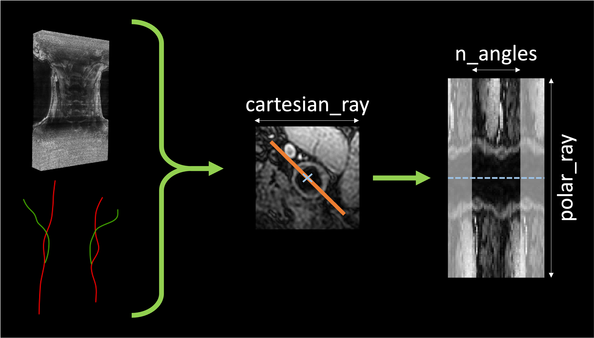

# `polar` - Draw 3D polar images

This step generates one polar image per center found in the previous step.

First a local patch around the center is extracted  from the original image. 
Then a polar transform is applied to this local patch: in the cartesian space
<code>n_angles</code> rays of size <code>cartesian_ray</code> are drawn. Along each of these rays a number 
of <code>polar_ray</code> values are interpolated. Each ray is sampled twice, resulting in a 2D polar image of size 
(`2*n_angles`, <code>polar_ray</code>).
This operation is done for the `length` neighbouring axial slices, resulting in a 3D polar image of size
(`1`, `1`, <code>length</code>, `2*n_angles`, <code>polar_ray</code>) after addition of the channel
and batch dimension.


<p style="text-align: center;"><b>Example of polar image extracted. The center is highlighted in blue, and 
an example of ray drawn in the cartesian space is highlighted in orange.</b></p>

## Prerequisites

This step relies on the outputs of `transform centerline` and raw images.
The path to raw images is found on the JSON file listing all parameters.

!!! warning "JSON parameters"
    This step does not only require the centerline TSV files but will try to
    load and update the `parameters.json` file in the directory in which centerlines are
    stored. Make sure this file exists at the root of the centerline directory.


## Running the task

The task can be run with the following command line:
```
carotid transform polar OUTPUT_DIR
```
where:

- `OUTPUT_DIR` (str) is the path to the directory containing the outputs.

Options:

- `--centerline_dir` (str) is the path to a different directory in which the centerlines are stored.
Default will assume that `transform centerline` was run in the output directory.
- `--config_path` (str) is the path to a config file defining the values of the parameters.
- `--participant` (List[str]) restricts the application of the transform to this list of participant IDs. 
Default will perform the pipeline on all participants with a raw image.
- `--force` is a flag that forces the application of the transform in the chosen output directory,
even if the transform was already performed in this folder.

## Default parameters

The following values can be chosen by the user:

- `n_angles` (int) Number of rays that are interpolated. Default: `31`.
- `polar_ray` (int) Size of the ray in the polar space. Default: `127`. 
- `cartesian_ray` (int) Size of the ray in the cartesian space. Default: `100`.
- `length` (int) Number of axial slices used for one polar image. Default: `7`.
- `multiple_centers` (bool) if `True`, a batch of 3D polar images of size (`9`, `1`, <code>length</code>, `2*n_angles`, <code>polar_ray</code>) will be extracted.
This 9 images correspond to the polar transform according to the 8 voxels around the original center in the given axial plane + the
original center. Default is `False`.

## Outputs


Output structure for participant `participant_id`:
```console
<output_dir>
├── parameters.json
└── <participant_id>
        └── polar_transform
                ├── left_polar
                │       ├── label-<internal|external>_slice-<slice_idx>_center.npy
                │       ├── label-<internal|external>_slice-<slice_idx>_polar.npy
                │       ├── ...
                │       └── parameters.json
                └── right_polar
```

where:

- `parameters.json` is a JSON file summarizing the parameters used to perform this transform and eventually preceding ones.
- `<side>_polar` is a folder containing the following objects:
  - `label-<internal|external>_slice-<slice_idx>_center.npy` is the numpy array of the center coordinates
  of the polar image corresponding to the internal or external carotid on slice number `slice_idx`.
  - `label-<internal|external>_slice-<slice_idx>_polar.npy` is the numpy array corresponding to a batch of
  3D polar images extracted using the associated center.
  - `parameters.json` stores meta-data associated to the raw image (spatial shape and affine).