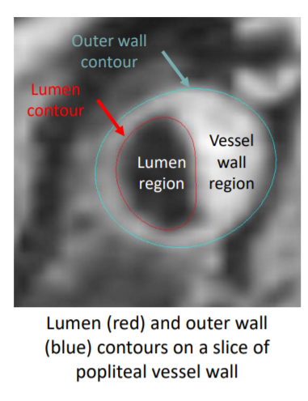
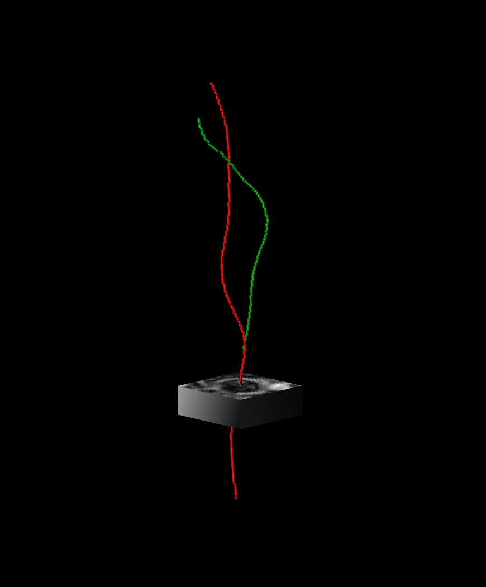

# Documentation of the carotid-segmentation package

This documentation describes how to install, use and test the source code of `carotid-segmentation`, the winning algorithm 
of the MICCAI Grand Challenge [Carotid Artery Vessel Wall Segmentation Challenge](https://vessel-wall-segmentation.grand-challenge.org/).
This algorithm computes the contours of the lumens and walls of the internal and external carotids 
on both sides of the neck from 3D black-blood MRI.

<figure>

<figcaption align = "center"><b>Figure originally created by the Grand Challenge organisers: lumen (red) and outer
wall (blue) contours of a popliteal vessel.</b></figcaption>
</figure>

The method was originally developed in the team of [Mathematics of Imaging & AI](https://www.utwente.nl/en/eemcs/sacs/people/sort-chair/?category=mia)
presented in SPIE Medical Imaging [(Alblas et al., 2022)](https://ris.utwente.nl/ws/portalfiles/portal/283040086/120320Y_alblas_brune_wolterink.pdf)

It mainly consists of two steps:

1. A *centerline* is estimated for the external and internal carotids on both sides,
2. The *lumen* and *wall* is locally estimated on each axial slice using a patch centered on the previously found centerline.

<figure>

<figcaption align = "center"><b>Figure illustrating how the algorithm works: the external (green)
and internal (red) centerlines of the carotids are extracted, then patches are locally extracted around
the centerlines to estimate the contours of the lumen and wall.</b></figcaption>
</figure>

!!! note "grand challenge demo"
    You can visualize the segmentation produced by the algorithm on the 
    [grand-challenge platform](https://grand-challenge.org/algorithms/carotid-artery-vessel-wall-segmentation/).
    The example image is from the training set of the MICCAI grand challenge.

## Installation

You will need a Python environment to run `carotid-segmentation`. We advise you to use Miniconda. 
Miniconda allows you to install, run, and update Python packages and their dependencies. 
It can also create environments to isolate your libraries. 
To install Miniconda, open a new terminal and type the following commands:

If you are on Linux:
```console
curl https://repo.anaconda.com/miniconda/Miniconda3-latest-Linux-x86_64.sh -o /tmp/miniconda-installer.sh
bash /tmp/miniconda-installer.sh
```
If you are on Mac:
```
curl https://repo.anaconda.com/miniconda/Miniconda3-latest-MacOSX-x86_64.sh -o /tmp/miniconda-installer.sh
bash /tmp/miniconda-installer.sh
```

The method is distributed as a PyPi package and can be installed with the following commands:

```
conda create -n carotid-segmentation python=3.9
conda activate carotid-segmentation
pip install carotid-segmentation
```

Check that the package is correctly installed by typing the following command in your terminal:
```console
carotid --help
```
You should obtain the following prompt:
```console
Usage: carotid [OPTIONS] COMMAND [ARGS]...

  carotid-segmentation command line.

Options:
  --version   Show the version and exit.
  -h, --help  Show this message and exit.

Commands:
  convert    Convert raw data sets to the format used by the library.
  transform  Transform 3D black-blood MRI in different steps of the carotid segmentation algorithm.
  compare    Compare the outputs of two different settings of the same transform.
  train      Train network to perform the tasks used by the pipeline.
```


## Application to your data set

Refer to the [data](Environment/Data.md) and [models](Environment/Models.md) sections
to correctly prepare your environment.

This package is meant to be run with a command line, but an API is also available for each transform.
To run any of the transform use the following command in your terminal:
```
carotid transform <transform_name> [OPTIONS] [ARGUMENTS]
```
You can also compare the results obtained with annotations using the comparison tools:
```
carotid compare <transform_name> [OPTIONS] [ARGUMENTS]
```

More information about each command is available in the documentation.

## Citation

If you use this repo in a scientific article please add the following citation:
```
@article{alblasDeepLearningBasedCarotid2021,
  title = {Deep {{Learning-Based Carotid Artery Vessel Wall Segmentation}} in {{Black-Blood MRI Using Anatomical Priors}}},
  author = {Alblas, Dieuwertje and Brune, Christoph and Wolterink, Jelmer M.},
  year = {2021},
  journal = {arXiv:2112.01137 [cs, eess]},
  eprint = {2112.01137},
  primaryclass = {cs, eess},
  urldate = {2022-02-16},
  archiveprefix = {arxiv},
  note = {Comment: SPIE Medical Imaging 2022}
}
```

## Test

The package is tested with the CI of Gitlab. You can also run yourself the tests with `pytest`.
First install the requirements for the tests in your conda environment:
```
conda activate carotid-segmentation
cd <repo-path>
pip install -r tests/requirements.txt
```

Then get the data necessary to run the tests.
- On Mac / Linux:

```
make prepare-test
```
- On Windows:

Download test data using this [link](https://surfdrive.surf.nl/files/index.php/s/e13O5s7PPTsJNli/download).
Unzip the downloaded tar file and move the directories in the `tests` folder.
Create a `models` directory in the `tests` folder and copy one of each of the model contained in your root
`models` folder (you can also put all the models, but the tests take a longer time).

The final architecture should be the following:
```console
tests
├── centerline_transform
│       ├── input
│       ├── reference
│       ├── test_args.toml
│       └── test_centerline_transform.py
...
├── models
│       ├── contour_transform
│       ├── contour_transform_dropout
│       └── heatmap_transform
...
├── raw_dir
│       ├── 0_P125_U.mha
│       └── parameters.json
...
```

You can now run the tests with pytest:
```
pytest tests/
```
