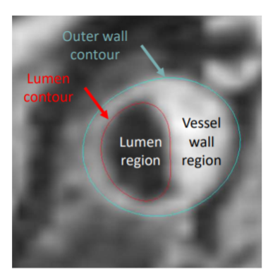

# Documentation of the XXX method

This documentation describes how to install, use and test the source code of XXX, the winning algorithm 
of the MICCAI Grand Challenge [Carotid Artery Vessel Wall Segmentation Challenge](https://vessel-wall-segmentation.grand-challenge.org/).
This algorithm computes the contours of the lumens and walls of the internal and external carotids 
on both sides of the neck from 3D black-blood MRI.

<figure>

<figcaption align = "center"><b>Figure originally created by the Grand Challenge organisers</b></figcaption>
</figure>

The method was originally developed in the team of [Mathematics of Imaging & AI](https://www.utwente.nl/en/eemcs/sacs/people/sort-chair/?category=mia)
presented in SPIE Medical Imaging [(Alblas et al., 2022)](https://ris.utwente.nl/ws/portalfiles/portal/283040086/120320Y_alblas_brune_wolterink.pdf)

It mainly consists of two steps:
1. A centerline is estimated for the external and internal carotids on both sides,
2. The lumen and wall is locally estimated on each axial slice using a patch centered on the previously found centerline.


## Installation

You will need a Python environment to run XXX. We advise you to use Miniconda. 
Miniconda allows you to install, run, and update Python packages and their dependencies. 
It can also create environments to isolate your libraries. 
To install Miniconda, open a new terminal and type the following commands:

If you are on Linux:
```
curl https://repo.anaconda.com/miniconda/Miniconda3-latest-Linux-x86_64.sh -o /tmp/miniconda-installer.sh
bash /tmp/miniconda-installer.sh
```
If you are on Mac:
```
curl https://repo.anaconda.com/miniconda/Miniconda3-latest-MacOSX-x86_64.sh -o /tmp/miniconda-installer.sh
bash /tmp/miniconda-installer.sh
```

The method is distributed as a PyPi package and can be installed with the following commands:

```
conda create -n carotid-segmentation python=3.9
conda activate carotid-segmentation
pip install XXX
```

Check that the package is correctly installed by typing the following command in your terminal:
```console
carotid --help
```
You should obtain the following prompt:
```console
Usage: carotid [OPTIONS] COMMAND [ARGS]...

  carotid-segmentation command line.

Options:
  --version   Show the version and exit.
  -h, --help  Show this message and exit.

Commands:
  heatmap_transform       Extract heatmaps from raw images using pre-trained U-Nets.
  centerline_transform    Extract centerlines from heatmaps computed with heatmap_transform with the Dijkstra algorithm.
  polar_transform         Extract polar images from raw images based on the centerlines found with centerline_transform.
  contour_transform       Extract contours from raw images and corresponding polar images computed by polar_transform.
  segmentation_transform  Extract a voxel mask from the point clouds of the contours computed with contour_transform.
  pipeline_transform      Execute the full pipeline from heatmap_transform to segmentation_transform.
```


## Application to your data set

### Getting the models

- On Mac / Linux:

You can use the following command to fetch all the models:
```
make get-models
```

- On Windows:

Models can be downloaded with [this link](https://surfdrive.surf.nl/files/index.php/s/DanUvHpx6BXM7dY/download)
Unzip the tar file and copy the different folders in the `models` folder at the root of the repo.

The final architecture of your repo should be the following:
```
carotid-segmentation
├── models
│       ├── contour_transform
│       ├── contour_transform_dropout
│       └── heatmap_transform
│               ├── <filename1>.pt
│               ├── ....
│               └── <filenameN>.pt
...
```

### Data structure

XXX was trained to segment carotids from 3D black-blood MRI volumes. 
The raw data can be provided as DICOM, MHD or MHA files.

Structure of the raw directory for DICOM files:

```console
raw_dir
├── <participant1>
│       ├── <filename1>.dcm
│       ...
│       └── <filenameN>.dcm
...
└── <participantN>
        ├── <filename1>.dcm
        ...
        └── <filenameN>.dcm
```

Structure of the raw directory for MHA/MHD files:

```console
raw_dir
├── <participant1>.mha
...
└── <participantN>.mha
```

!!! warning
    The orientation of your volume is crucial for the algorithm.
    Please make sure that your tensor and affine allows to correctly orientate your image.
    The algorithm also assumed that your image has an isotropic resolution in an axial slice.

!!! note
    Participants will be associated with a `participant_id`. For DICOM files it will correspond
    to the names of the directories, and for the MHD/MHA files to the filename without the extension.

### Command line

This package is meant to be run with a command line, but an API is also available for each transform.
To run any of the transform use the following command in your terminal:
```
carotid <transform_name> [OPTIONS] [ARGUMENTS]
```
More information about each command is available in the documentation. 

## Test

The package is tested with the CI of Gitlab. You can also run yourself the tests with `pytest`.
First install the requirements for the tests in your conda environment:
```
conda activate carotid-segmentation
cd <repo-path>
pip install -r tests/requirements.txt
```

Then get the data necessary to run the tests.
- On Mac / Linux:

```
make prepare-test
```
- On Windows:

Download test data using this [link](https://surfdrive.surf.nl/files/index.php/s/e13O5s7PPTsJNli/download).
Unzip the downloaded tar file and move the directories in the `tests` folder.
Create a `models` directory in the `tests` folder and copy one of each of the model contained in your root
`models` folder (you can also put all the models, but the tests take a longer time).

The final architecture should be the following:
```console
tests
├── centerline_transform
│       ├── input
│       ├── reference
│       ├── test_args.toml
│       └── test_centerline_transform.py
...
├── models
│       ├── contour_transform
│       ├── contour_transform_dropout
│       └── heatmap_transform
...
├── raw_dir
│       ├── 0_P125_U.mha
│       └── parameters.json
...
```

You can now run the tests with pytest:
```
pytest tests/
```
